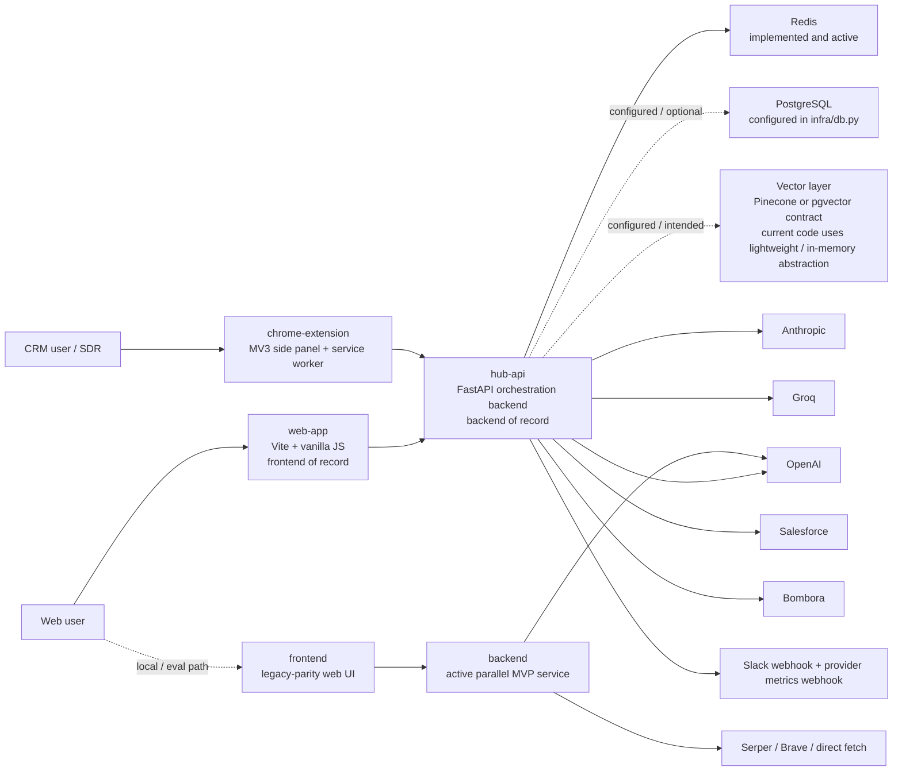

# EmailDJ Architecture

Snapshot date: March 18, 2026
Repository snapshot basis: local git HEAD on March 18, 2026

Status legend used throughout this document:
- `implemented and active`
- `configured/documented but only partially implemented`
- `active parallel service / parity surface`

## 1. PROJECT STRUCTURE

This tree is architecture-oriented, not a literal dump of every generated artifact in the repository. It shows all meaningful top-level files and folders, expands architectural source/config/test paths deeply, and summarizes artifact-heavy directories such as `backend/debug_traces/`, `hub-api/debug_runs/`, and `hub-api/reports/` instead of enumerating thousands of generated files.

### Product Surfaces

```text
web-app/
├── .env.example
├── index.html
├── package-lock.json
├── package.json
├── vite.config.js
├── src/
│   ├── api/
│   │   └── client.js
│   ├── components/
│   │   ├── EmailEditor.js
│   │   ├── SDRPresetLibrary.js
│   │   ├── SliderBoard.js
│   │   └── presetPreviewUtils.js
│   ├── data/
│   │   └── sdrPresets.js
│   ├── main.js
│   ├── streamContract.js
│   ├── style.js
│   └── utils.js
├── tests/
│   ├── api-client.test.js
│   ├── debounce.test.js
│   ├── preset-library-cache-behavior.test.js
│   ├── preset-library.test.js
│   ├── preset-preview-batch-payload.test.js
│   ├── preset-preview-cache.test.js
│   ├── preset-preview-parser.test.js
│   ├── sse-parser.test.js
│   ├── stream-contract.test.js
│   └── style.test.js
├── dist/ ... built static bundle (generated)
└── node_modules/ ... local dependency tree (ignored by .gitignore)

frontend/
├── .env.example
├── DESIGN.md
├── index.html
├── package-lock.json
├── package.json
├── vite.config.js
├── src/
│   ├── api/
│   │   └── client.js
│   ├── components/
│   │   ├── EmailEditor.js
│   │   ├── SDRPresetLibrary.js
│   │   ├── SliderBoard.js
│   │   └── presetPreviewUtils.js
│   ├── data/
│   │   └── sdrPresets.js
│   ├── main.js
│   ├── streamContract.js
│   ├── studioStatus.js
│   ├── style.js
│   ├── styles.css
│   └── utils.js
├── tests/
│   ├── api-client.test.js
│   ├── debounce.test.js
│   ├── preset-library-cache-behavior.test.js
│   ├── preset-library.test.js
│   ├── preset-preview-batch-payload.test.js
│   ├── preset-preview-cache.test.js
│   ├── preset-preview-parser.test.js
│   ├── sse-parser.test.js
│   ├── stream-contract.test.js
│   ├── studio-status.test.js
│   └── style.test.js
├── dist/ ... built static bundle (generated)
└── node_modules/ ... local dependency tree (ignored by .gitignore)

chrome-extension/
├── manifest.json
├── package-lock.json
├── package.json
├── scripts-bootstrap.sh
├── vite.config.js
├── public/
│   └── icons/
├── src/
│   ├── background/
│   │   └── service-worker.js
│   ├── content-scripts/
│   │   ├── index.js
│   │   ├── payload-assembler.js
│   │   ├── pii-prefilter.js
│   │   └── dom-parser/
│   │       ├── mutation-observer.js
│   │       ├── navigation-detector.js
│   │       ├── polling-fallback.js
│   │       ├── selector-registry.js
│   │       └── shadow-dom-walker.js
│   └── side-panel/
│       ├── hub-client.js
│       ├── index.html
│       ├── index.js
│       └── components/
│           ├── AssignedCampaigns.js
│           ├── ContextSummary.js
│           ├── EmailEditor.js
│           ├── PersonalizationSlider.js
│           └── QuickGenerate.js
├── tests/
│   ├── personalization-slider.test.js
│   └── pii-prefilter.test.js
├── dist/ ... built MV3 bundle (generated)
└── node_modules/ ... local dependency tree (ignored by .gitignore)
```

### Backend Services

```text
hub-api/
├── .env.example
├── README.md
├── main.py
├── openapi.json
├── pyproject.toml
├── requirements.txt
├── runtime_debug.py
├── agents/
│   ├── graph.py
│   ├── state.py
│   ├── nodes/
│   │   ├── audience_builder.py
│   │   ├── crm_query_agent.py
│   │   ├── deep_research_agent.py
│   │   ├── intent_classifier.py
│   │   ├── intent_data_agent.py
│   │   └── sequence_drafter.py
│   └── providers/
│       └── campaign_intelligence.py
├── api/
│   ├── schemas.py
│   ├── middleware/
│   │   ├── beta_access.py
│   │   ├── cost_guard.py
│   │   └── pii_redaction.py
│   └── routes/
│       ├── assignments.py
│       ├── campaigns.py
│       ├── context_vault.py
│       ├── deep_research.py
│       ├── quick_generate.py
│       ├── web_mvp.py
│       └── webhooks.py
├── context_vault/
│   ├── cache.py
│   ├── embedder.py
│   ├── extractor.py
│   ├── merger.py
│   └── models.py
├── delegation/
│   ├── engine.py
│   └── push_notifications.py
├── devtools/
│   ├── benchmark_pack.smoke.json
│   ├── benchmark_pack.ui_real.json
│   ├── fail_detectors.py
│   ├── fixture_loader.py
│   ├── fixtures/
│   ├── http_smoke_runner.py
│   └── run_smoke_watch.sh
├── docs/
│   └── limited_rollout_deployment_parity.md
├── email_generation/
│   ├── claim_verifier.py
│   ├── compliance_rules.py
│   ├── cta_templates.py
│   ├── generation_plan.py
│   ├── model_cascade.py
│   ├── model_defaults.py
│   ├── multi_thread.py
│   ├── offer_domain.py
│   ├── output_enforcement.py
│   ├── preset_preview_pipeline.py
│   ├── preset_strategies.py
│   ├── prompt_templates.py
│   ├── quick_generate.py
│   ├── rc_tco_controller.py
│   ├── remix_engine.py
│   ├── runtime_policies.py
│   ├── streaming.py
│   ├── text_postprocess.py
│   ├── text_utils.py
│   ├── truncation.py
│   └── policies/
│       ├── claims_policy.py
│       ├── cta_policy.py
│       ├── greeting_policy.py
│       ├── leakage_policy.py
│       ├── length_policy.py
│       ├── offer_lock_policy.py
│       ├── policy_metrics.py
│       └── policy_runner.py
├── evals/
│   ├── README.md
│   ├── checks.py
│   ├── generate_gold_set.py
│   ├── gold_set.adversarial.json
│   ├── gold_set.full.json
│   ├── gold_set.schema.json
│   ├── gold_set.smoke_ids.json
│   ├── io.py
│   ├── judge/
│   ├── models.py
│   ├── parity_ids.json
│   ├── runner.py
│   ├── sdr_quality.py
│   └── sdr_quality_pack.v1.json
├── infra/
│   ├── alerting.py
│   ├── db.py
│   ├── redis_client.py
│   └── vector_store.py
├── pii/
│   ├── presidio_redactor.py
│   └── token_vault.py
├── scripts/
│   ├── bootstrap_backend.sh
│   ├── capture_runtime_snapshot.py
│   ├── capture_ui_session.py
│   ├── checks.sh
│   ├── debug_run_harness.py
│   ├── dev_real_defaults_report.py
│   ├── doc_freshness_check.py
│   ├── eval:adversarial
│   ├── eval:focus
│   ├── eval:full
│   ├── eval:judge:calibrate
│   ├── eval:judge:drift-guard
│   ├── eval:judge:full
│   ├── eval:judge:pairwise
│   ├── eval:judge:real-corpus
│   ├── eval:judge:regression-gate
│   ├── eval:judge:sanity
│   ├── eval:judge:smoke
│   ├── eval:judge:stability
│   ├── eval:judge:trend
│   ├── eval:parity
│   ├── eval:smoke
│   ├── eval_sdr_quality.py
│   ├── generate_openapi.py
│   ├── launch_check.py
│   ├── launch_preflight.py
│   ├── mock_e2e_smoke.py
│   ├── real_mode_failfast_smoke.py
│   ├── real_mode_smoke.py
│   └── web_mvp_metrics.py
├── tests/
│   ├── evals/
│   ├── fixtures/
│   ├── integration/
│   ├── test_capture_runtime_snapshot.py
│   ├── test_claim_verifier.py
│   ├── test_context_extractor.py
│   ├── test_context_models.py
│   ├── test_contracts.py
│   ├── test_cta_policy.py
│   ├── test_ctco_validation.py
│   ├── test_debug_run_harness.py
│   ├── test_deep_research_node.py
│   ├── test_extractor_guardrails.py
│   ├── test_fail_detectors.py
│   ├── test_generation_env_validation.py
│   ├── test_golden_scenarios.py
│   ├── test_http_smoke_runner.py
│   ├── test_launch_check.py
│   ├── test_launch_preflight.py
│   ├── test_middleware_order.py
│   ├── test_model_defaults.py
│   ├── test_output_enforcement.py
│   ├── test_p0_quality_features.py
│   ├── test_policy_runner.py
│   ├── test_preset_preview_pipeline.py
│   ├── test_quality_gate.py
│   ├── test_quick_generate_reliability.py
│   ├── test_rc_tco_controller.py
│   ├── test_runtime_rollout.py
│   ├── test_sse_and_pii.py
│   ├── test_stream_integrity.py
│   ├── test_template_denylist.py
│   ├── test_tenant_isolation.py
│   ├── test_truncation.py
│   └── test_web_mvp_engine.py
├── debug_runs/ ... captured UI sessions, smoke runs, and launch checks (generated, tracked)
├── reports/ ... launch, judge, provider, and SDR quality artifacts (generated, tracked)
├── .venv/ ... local virtualenv (ignored by architecture tree)
├── __pycache__/ ... Python cache directories (ignored by architecture tree)
└── .pytest_cache/ ... test cache directories (ignored by architecture tree)

backend/
├── .env.example
├── main.py
├── pyproject.toml
├── requirements.txt
├── app/
│   ├── blueprint.py
│   ├── cache.py
│   ├── config.py
│   ├── enrichment.py
│   ├── openai_client.py
│   ├── prompts.py
│   ├── rendering.py
│   ├── schemas.py
│   ├── server.py
│   ├── sse.py
│   ├── tools.py
│   ├── validators.py
│   └── engine/
│       ├── ai_orchestrator.py
│       ├── brief_cache.py
│       ├── brief_honesty.py
│       ├── budget_planner.py
│       ├── llm_realizer.py
│       ├── normalize.py
│       ├── pipeline.py
│       ├── planning.py
│       ├── postprocess.py
│       ├── preset_contract.py
│       ├── realize.py
│       ├── repair.py
│       ├── research_state.py
│       ├── schemas.py
│       ├── stage_a_sanitizer.py
│       ├── stage_runner.py
│       ├── tracer.py
│       ├── types.py
│       ├── validate.py
│       ├── validators.py
│       ├── presets/
│       │   ├── base.json
│       │   ├── challenger.json
│       │   ├── direct.json
│       │   ├── executive.json
│       │   ├── proof_first.json
│       │   ├── registry.py
│       │   └── storyteller.json
│       └── prompts/
│           ├── stage_a.py
│           ├── stage_b.py
│           ├── stage_b0.py
│           ├── stage_c.py
│           ├── stage_c0.py
│           ├── stage_d.py
│           └── stage_e.py
├── evals/
│   ├── debug_stage.py
│   ├── eval_payloads.py
│   ├── eval_report.py
│   ├── eval_run.py
│   ├── golden/
│   └── stage_judge.py
├── tests/
│   ├── test_ai_orchestrator_fail_closed.py
│   ├── test_api_no_provenance_leak.py
│   ├── test_api_smoke.py
│   ├── test_budget_planner.py
│   ├── test_debug_prompt_flag.py
│   ├── test_engine_contract_hardening.py
│   ├── test_engine_evals.py
│   ├── test_eval_run_artifacts.py
│   ├── test_length_beats_non_outbound.py
│   ├── test_llm_realizer_pipeline.py
│   ├── test_messaging_brief_quality.py
│   ├── test_postprocess.py
│   ├── test_preset_contracts.py
│   ├── test_prompt_assembly_contamination.py
│   ├── test_research_api.py
│   ├── test_sales_outbound_category.py
│   ├── test_stage_a_sanitizer.py
│   ├── test_stage_a_validator.py
│   ├── test_stage_judge.py
│   ├── test_stage_prompt_contracts.py
│   ├── test_stage_runner.py
│   ├── test_trace_artifacts.py
│   └── test_validators.py
├── debug_traces/ ... staged trace JSON by date (generated, tracked)
├── __pycache__/ ... Python cache directories (ignored by architecture tree)
└── .pytest_cache/ ... test cache directories (ignored by architecture tree)
```

### Documentation and Governance

```text
docs/
├── ACCEPTANCE_CHECKLIST.md
├── Architecture Diagram.md
├── CHRONICLE.md
├── EmailDJ SDR Presets.md
├── IMPLEMENTATION_MAP.md
├── PORT_LIST.md
├── README.md
├── TASKS.md
├── judge_eval_runbook.md
├── local-dev.md
├── lock_compliance_runbook.md
├── remix-studio-forensic-report.md
├── _meta/
│   ├── doc_coverage_map.md
│   ├── docmap.yaml
│   ├── glossary.md
│   └── sweep-2026-03-02.patch.md
├── adr/
│   ├── 0000-template.md
│   ├── 0001-lock-enforcement-model.md
│   └── README.md
├── architecture/
│   ├── backend.md
│   ├── data_state.md
│   ├── frontend.md
│   └── overview.md
├── contracts/
│   ├── openapi.md
│   ├── openapi_diff.md
│   ├── openapi_snapshot.json
│   ├── openapi_summary.md
│   ├── schemas.md
│   └── streaming_sse.md
├── ops/
│   ├── deployment.md
│   ├── docops_guardian.md
│   ├── env_matrix.md
│   ├── launch_operator.md
│   ├── release_checklist.md
│   └── runbooks.md
├── policy/
│   ├── control_contract.md
│   ├── prompt_contracts.md
│   └── validator_rules.md
└── product/
    ├── positioning.md
    └── presets.md

.github/
└── workflows/
    ├── ci.yml
    ├── docs-nightly.yml
    └── eval_regression.yml

scripts/
├── check_contamination.sh
├── check_no_secrets.sh
├── dev.sh
└── docops/
    ├── check_doc_freshness.py
    └── generate_docs.py
```

### Support and Reference Assets

```text
shared/
└── contracts.md

Stage Prompts/
├── backend:app:engine:prompts:stage_a.rtf
├── backend:app:engine:prompts:stage_b.rtf
├── backend:app:engine:prompts:stage_b0.rtf
├── backend:app:engine:prompts:stage_c.rtf
├── backend:app:engine:prompts:stage_c0.rtf
├── backend:app:engine:prompts:stage_d.rtf
└── backend:app:engine:prompts:stage_e.rtf

.agents/
└── skills/
    ├── a11y-performance-polisher/
    ├── component-story-writer/
    ├── design-system-guardian/
    ├── emaildj-copy-qa-reviewer/
    ├── emaildj-preset-regression-hunter/
    ├── emaildj-smoke-eval-runner/
    ├── emaildj-stage-schema-keeper/
    ├── emaildj-trace-auditor/
    ├── figma-to-code-implementer/
    ├── frontend-ux-critic/
    └── ui-architect/

.claude/
├── agent-memory/
│   └── project-chronicler/
│       └── MEMORY.md
└── skills/
    └── docops-guardian/
        └── SKILL.md
```

### Root Files

```text
.
├── .gitignore
├── 0.5 mvp plan.rtf
├── AGENTS.md
├── ARCHITECTURE.md
├── EMAILDJ EVAL HARNESS + LLM JUDGE — MASTER CODEX PROMPT.rtf
├── EmailDJ_Concept.md
├── Makefile
└── README.md
```

Local-only or VCS metadata intentionally omitted from the architecture tree: `.git/`, `.DS_Store`, `.env` files, `.venv/`, `node_modules/`, `dist/`, `__pycache__/`, and `.pytest_cache/`.

## 2. HIGH-LEVEL SYSTEM DIAGRAM



Primary deployment lane:
- Web users enter through `web-app`
- CRM-side users enter through the Chrome extension
- Both primary client surfaces call `hub-api`
- `hub-api` actively uses Redis and provider APIs, while Postgres and Pinecone/pgvector are more strongly represented in configuration and docs than in concrete storage implementation

Secondary parallel lane:
- `frontend` + `backend` remain a runnable MVP stack used in local development, acceptance checks, and eval work
- They are not the frontend/backend of record for deployment guidance

## 3. CORE COMPONENTS

| Component | Status | Purpose | Primary technologies | Deployment method |
|---|---|---|---|---|
| `web-app/` | implemented and active | Primary browser UI for generate/remix, preset preview, runtime inspection, and SSE draft streaming | Vite 5, vanilla JS, browser `fetch`, localStorage | Static frontend of record; documented for Vercel deployment |
| `chrome-extension/` | implemented and active | CRM-side entry surface with DOM extraction, PII prefiltering, side-panel editing, and assignment polling | Chrome Extension Manifest V3, Vite, `@crxjs/vite-plugin`, vanilla JS | Built MV3 bundle loaded or distributed as a Chrome extension |
| `hub-api/` | implemented and active | Backend of record for generation, remix, preview, quick generate, campaign flows, context vault, deep research, webhook capture, and rollout controls | FastAPI, Pydantic, `httpx`, Redis client, SQLAlchemy async stub, Presidio, LangGraph/LangChain dependencies, SSE | Persistent `uvicorn` service; docs prefer Render over serverless runtimes |
| `backend/` | active parallel service / parity surface | MVP 0.5 backend for generate/remix, enrichment, preset preview, staged evaluation, and trace artifact generation | FastAPI, Pydantic, `httpx`, SSE, staged prompt/orchestrator pipeline | Local/dev-oriented `uvicorn` service started by root `make dev`; not backend of record |
| `frontend/` | active parallel service / parity surface | Legacy-parity Remix Studio web UI paired with `backend/`; exposes richer diagnostics and trust surfaces than `web-app` | Vite 5, vanilla JS, browser `fetch`, localStorage | Local/dev or parity surface, not frontend of record |

`hub-api` subsystems are in-process modules, not separate deployables:
- `api/` exposes FastAPI middleware, schemas, and route handlers
- `email_generation/` contains prompt construction, provider selection, policy enforcement, streaming, and repair logic
- `context_vault/` handles extract/merge/cache models for account context
- `delegation/` manages assignment state and pull-style work distribution
- `agents/` implements the VP campaign graph and provider-backed audience assembly helpers
- `pii/` provides server-side redaction and token vault utilities
- `infra/` holds Redis, database, alerting, and vector-store abstractions

## 4. DATA STORES

| Store | Type | Purpose | Key schemas / collections | Implementation status |
|---|---|---|---|---|
| `hub-api` Redis | Redis with in-memory fallback | Active cache, rate limiting, assignment state, campaign state, webhook signal storage, quality metrics, provider failure counters, deep research job state | `campaign:*`, `assignment:*`, `sdr_assignments:*`, `vault:*`, `deep_research:job:*`, `webhook_signal:*`, `webhook_signals:*:ids`, `web_mvp:ratelimit:*`, `web_mvp:quality:*`, `quick_provider_failures:*`, `cost_tier*:*` | implemented and active |
| `hub-api` Postgres contract | PostgreSQL via SQLAlchemy async | Intended durable relational storage path for context and backend state beyond Redis | `DATABASE_URL` is wired, but concrete ORM tables and migrations are not present in the repo | configured/documented but only partially implemented |
| `hub-api` vector layer | Pinecone or pgvector contract, current code path is in-memory | Intended semantic retrieval for context-vault enrichment and search | `VECTOR_STORE_BACKEND`, `PINECONE_*` env vars; current `vector_store.py` stores embeddings in `_MEM` rather than a real external index | configured/documented but only partially implemented |
| `backend` in-memory state | Python dicts and TTL caches | Request/session registry, research jobs, enrichment cache, brief cache, rate limiting, and trace bookkeeping for the MVP 0.5 service | `AppState.requests`, `AppState.sessions`, `AppState.research_jobs`, `TTLCache`, `BriefCache` | active parallel service / parity surface |
| Browser-side state | `window.localStorage` plus transient in-memory token maps | Beta key, seller/prospect form state, UI preferences, and ephemeral PII token maps in client surfaces | `emaildj_beta_key`, company context keys, research defaults, client-side token maps held in memory only | implemented and active |

Message queues:
- No dedicated queue broker such as RabbitMQ, Kafka, SQS, Celery, or Redis Streams is present in this repository
- `hub-api` uses in-process async tasks plus Redis-backed key state for long-running or polled work such as deep research and assignment state
- `backend` uses in-process async tasks and process-local dictionaries for research jobs and SSE request tracking

## 5. EXTERNAL INTEGRATIONS

| Service | Used by | Purpose | Integration method | Status |
|---|---|---|---|---|
| OpenAI | `hub-api`, `backend` | Draft generation, structured-output parsing, enrichment/extraction, preview generation | Direct HTTPS REST calls via `httpx` to `/v1/chat/completions` | implemented and active |
| Anthropic | `hub-api` | Alternate real-provider path in the model cascade | Direct HTTPS REST calls via `httpx` to `/v1/messages` | implemented and active when configured |
| Groq | `hub-api` | Alternate real-provider path in the model cascade | Direct HTTPS REST calls via `httpx` to `/openai/v1/chat/completions` | implemented and active when configured |
| Salesforce | `hub-api` | CRM account retrieval for campaign intelligence | Provider adapter in `agents/providers/campaign_intelligence.py` using bearer-token REST queries | implemented and active when configured; mock fallback exists |
| Bombora | `hub-api` | Intent-signal retrieval for campaign intelligence | Provider adapter in `agents/providers/campaign_intelligence.py` using HTTP POST | implemented and active when configured; mock fallback exists |
| Slack webhook | `hub-api` | Alert sink for provider-failure and runtime operations notifications | Webhook-based alert emission from `infra/alerting.py` | implemented and active when configured |
| Provider metrics webhook | `hub-api` | Secondary operational event sink for failure telemetry | Webhook-based alert emission from `infra/alerting.py` | implemented and active when configured |
| Serper | `backend` | Primary web search provider for enrichment lookups | Direct HTTPS REST calls to `google.serper.dev/search` | implemented and active when configured |
| Brave Search | `backend` | Search fallback for enrichment lookups | Direct HTTPS REST calls to `api.search.brave.com` | implemented and active when configured |
| Public website fetch | `backend` | Fetches arbitrary page text for tool-based enrichment extraction | Direct outbound HTTP GET requests via `httpx` | implemented and active |
| LangSmith | `hub-api` env contract | Intended tracing/project instrumentation | Documented in `.env.example`; not obviously wired into core runtime request flow in current code | configured/documented but only partially implemented |

Integrations intentionally excluded:
- No Stripe, SendGrid, Firebase, Auth0, Clerk, Sentry, Datadog, or cloud object-store integrations are present in the current codebase
- Pinecone is referenced as a vector-store target, but the current code path still uses an in-memory abstraction rather than a live client integration

## 6. DEPLOYMENT & INFRASTRUCTURE

Documented deployment split:
- `web-app` -> static frontend deployed on Vercel
- `hub-api` -> persistent Python service, with Render explicitly preferred in repo deployment docs
- `chrome-extension` -> built MV3 artifact loaded or distributed as a Chrome extension
- `backend` + `frontend` -> local/dev or parity stack, not the deployment target of record

Infrastructure posture:
- No Dockerfiles, Kubernetes manifests, Terraform, Pulumi, or `render.yaml` blueprint are committed in this repository
- Infrastructure is described through environment contracts, shell scripts, and deployment runbooks rather than IaC
- Managed Redis is assumed for deployed `hub-api`
- Postgres and vector-store backends are expected by configuration, but the committed code does not yet realize full durable implementations

Key deployment and operational assets:
- CI pipeline: `.github/workflows/ci.yml`
- Eval regression pipeline: `.github/workflows/eval_regression.yml`
- Docs nightly sweep: `.github/workflows/docs-nightly.yml`
- Launch preflight: `hub-api/scripts/launch_preflight.py`
- Runtime snapshot capture: `hub-api/scripts/capture_runtime_snapshot.py`
- Launch readiness checker: `hub-api/scripts/launch_check.py`
- Nightly and smoke eval entrypoints: `hub-api/scripts/eval:*`, `hub-api/scripts/mock_e2e_smoke.py`, `hub-api/scripts/real_mode_smoke.py`

Monitoring and observability:
- `hub-api` runtime debug endpoint surfaces rollout state, provider source, origins, beta-key safety, release fingerprint, and route gates
- Provider failure counters are stored in Redis and can emit Slack or metrics webhook alerts
- Launch artifacts are persisted under `hub-api/reports/launch/`
- Quality, judge, and provider verification artifacts are persisted under `hub-api/reports/`
- The MVP `backend` service preserves stage traces and raw debug artifacts under `backend/debug_traces/`

## 7. SECURITY CONSIDERATIONS

Authentication and access controls actually present in code:
- `/web/v1` routes in `hub-api` are protected by the `X-EmailDJ-Beta-Key` header and Redis-backed rate limiting
- `backend` applies its own beta-key gate for the MVP web flow
- Campaign approval in `hub-api` requires `x-user-id` and `x-user-role`, and only `vp` or `admin` roles are authorized
- Route availability in `hub-api` is further controlled by launch mode and route-gating policies

Authorization model:
- `hub-api` uses role checks for sensitive campaign approval actions
- The active web flow does not implement end-user accounts, sessions, JWTs, OAuth2 login, or RBAC beyond the campaign-approval header check
- Salesforce OAuth-style environment variables are present, but a user-facing OAuth flow is not wired into the active request path

PII and sensitive-data handling:
- Layer 1: Chrome extension regex prefilter redacts email, phone, SSN, and credit card patterns before payloads leave the browser
- Layer 2: `hub-api` Presidio-based middleware redacts PII server-side, with regex fallback if Presidio is unavailable
- Layer 3: token vault utilities detokenize request-scoped placeholders after processing
- `backend` also uses enrichment and tracing controls, but its state remains process-local rather than durably encrypted

Network and transport assumptions:
- External integrations use HTTPS URLs
- Deployment docs assume HTTPS origins for the deployed frontend and backend
- TLS termination and at-rest encryption are infrastructure concerns rather than repo-enforced controls

CORS and origin pinning:
- `hub-api` derives allowed origins from `WEB_APP_ORIGIN`, `CHROME_EXTENSION_ORIGIN`, and local dev allowlists
- Production-like environments explicitly reject localhost-only web origins and default/dev beta-key configurations

Secrets and scanning:
- Secrets are environment variables or GitHub Actions secrets
- Root secret scanning is handled by `scripts/check_no_secrets.sh`
- Prompt contamination checks are handled by `scripts/check_contamination.sh`

Not present:
- No JWT issuer
- No OAuth2 user login for the web app
- No signed API keys beyond the beta-key header model
- No committed KMS, Vault, or envelope-encryption integration

## 8. DEVELOPMENT & TESTING

Local setup paths:
- Root MVP flow: `Makefile` and `scripts/dev.sh` start `backend` + `frontend`
- Backend-of-record flow: `docs/local-dev.md` describes `hub-api`, `web-app`, and `chrome-extension`

Primary development/test tooling:
- Python: `pytest`, `pytest-asyncio`, `python -m py_compile`
- JavaScript: Node built-in `node --test`, `node --check`
- Build tooling: Vite for all browser surfaces, `@crxjs/vite-plugin` for the extension
- Contract tooling: generated `openapi.json`, OpenAPI snapshot and summary docs
- Documentation quality: doc freshness checks and generated-doc freshness checks
- Security hygiene: secret scan and contamination checks
- Evaluation harnesses:
  - `backend/evals/` for staged pipeline evaluation
  - `hub-api/evals/` for smoke, parity, adversarial, judge, and SDR quality evaluation

Surface-specific test posture:
- `backend` has a substantial Python test suite focused on fail-closed staged generation, API smoke, trace artifacts, and eval reporting
- `hub-api` has unit, integration, launch, and policy suites covering web routes, runtime gating, PII, streaming, launch checks, and provider behavior
- `web-app`, `frontend`, and `chrome-extension` all use small Node test suites for API parsing, SSE parsing, preset handling, debounce behavior, style conversion, and extension-specific UI utilities

CI/CD checks performed in-repo:
- `ci.yml` runs secret scanning, doc freshness, generated-doc freshness, hub-api setup, extension tests, and the full `hub-api/scripts/checks.sh` quality gate
- `eval_regression.yml` runs the `backend` eval harness against payloads and optional golden reports
- `docs-nightly.yml` regenerates selected docs and opens a PR automatically

Notable absent tools:
- No ESLint configuration
- No SonarQube
- No Prettier
- No Terraform
- No Kubernetes manifests

## 9. FUTURE CONSIDERATIONS

- `hub-api` holds generate/remix request state in process-local memory before SSE consumers attach, which is unsafe for uncontrolled horizontal scaling or serverless routing.
- The `hub-api` Postgres and vector-store contracts are ahead of concrete implementation; the repo config and docs imply more persistence than the committed code currently provides.
- Parallel stacks (`backend` + `frontend` vs `hub-api` + `web-app`) create a real documentation and behavior drift risk.
- The repository tracks large generated artifact sets such as debug traces, launch artifacts, and judge reports, which makes onboarding and architecture documentation heavier than the runtime code alone would suggest.
- Launch-readiness and rollout-parity tooling are stronger and more explicit than some of the underlying persistence implementations, which creates an “ops maturity ahead of storage maturity” gap.
- Preview routes, rollout modes, and route gating are intentionally constrained today; broadening them will require revisiting security, persistence, and deployment assumptions.
- If `hub-api` moves toward fully realized Postgres and Pinecone/pgvector usage, the repository will need concrete models, migrations, and a clearer storage ownership model.

## 10. GLOSSARY

| Term | Definition |
|---|---|
| SDR | Sales Development Representative; the repo uses this term for end users receiving assignments and drafting outbound emails. |
| CTA Lock | The exact CTA string that must appear once and only once in the final email body. |
| Offer Lock | The single product or service string the draft is allowed to pitch. |
| CTCO | Combined validation constraint set covering greeting, CTA lock, offer lock, compliance, and output formatting checks. |
| Context Vault | The `hub-api` account-context caching and enrichment subsystem centered around Redis and future durable stores. |
| MV3 | Chrome Extension Manifest V3, which requires a service worker instead of a persistent background page. |
| SSE | Server-Sent Events; token streaming transport used by the web UI and extension. |
| Repair Loop | Automatic retry path that attempts to bring model output back into compliance after validation failures. |
| Preview Batch Pipeline | The multi-preset preview path in `hub-api/email_generation/preset_preview_pipeline.py`. |
| Active parallel service | A runnable stack that still exists and is used for local development or evals, but is not the deployment target of record. |
| Frontend of record | The primary browser UI surface described by deployment docs; in this repo that is `web-app/`. |
| Backend of record | The primary API/orchestration backend described by deployment docs; in this repo that is `hub-api/`. |
| Side panel | The persistent MV3 UI page inside the Chrome extension that owns most client state. |
| Service worker | The extension background worker that handles alarms, messages, and lifecycle hooks but is not the persistent UI state owner. |
| Beta key | The shared secret header value used to gate `web-app` requests into `/web/v1` routes. |
| Runtime debug payload | The structured launch/readiness snapshot emitted by `hub-api/runtime_debug.py` and exposed through the debug endpoint. |
| Presidio | The Microsoft Presidio library used for server-side PII detection and anonymization. |
| Token vault | Request-scoped tokenization/detokenization mapping used to preserve placeholders while keeping raw values out of provider prompts. |

## 11. PROJECT IDENTIFICATION

| Field | Value |
|---|---|
| Project name | `EmailDJ` |
| Repository URL | `https://github.com/Mohit4022-cloud/EmailDJ.git` |
| Primary contact/team | `Mohit4022-cloud` |
| Date of last update | `2026-03-18` |
| Snapshot note | Derived from local git HEAD on March 18, 2026 |
