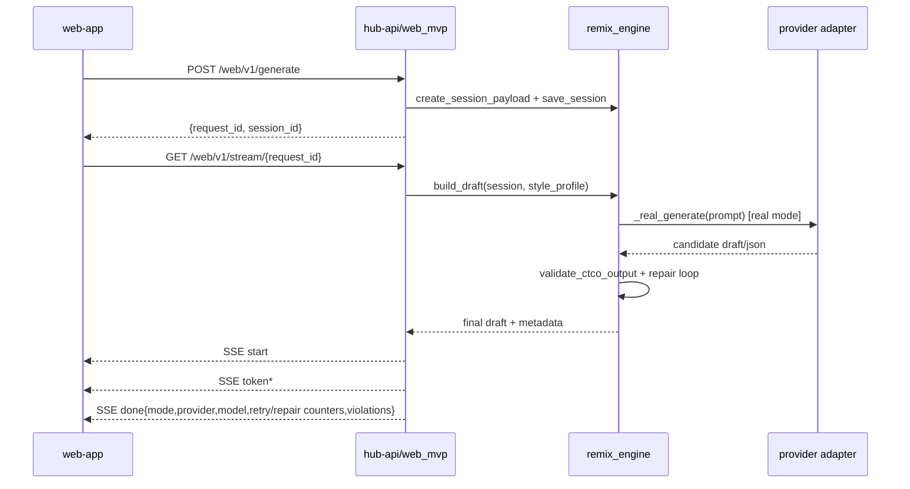

# Architecture Overview

## Product Intent
EmailDJ is a controlled outbound drafting system for SDR workflows. The core intent is to generate or remix outreach drafts while preserving lock constraints (offer, CTA, compliance) and making drift observable through validation metadata.

Source anchors:
- `hub-api/api/routes/web_mvp.py`
- `hub-api/email_generation/remix_engine.py`
- `hub-api/email_generation/preset_preview_pipeline.py`
- `web-app/src/main.js`
- `web-app/src/api/client.js`

## Repository Inventory
| Top-level path | Purpose |
|---|---|
| `hub-api/` | FastAPI backend, generation engines, validators, eval harness, runtime scripts |
| `web-app/` | Vite web UI for generate/remix + preset preview UX |
| `chrome-extension/` | Browser extension client surface |
| `docs/` | Architecture, policy, contracts, ops, product docs |
| `.github/workflows/` | CI, nightly automation workflows |
| `scripts/docops/` | DocOps generators and freshness gates |
| `EmailDJ_Concept.md` | Product concept source narrative |

## Subsystem Map
| Domain | Paths | Notes |
|---|---|---|
| Backend API | `hub-api/main.py`, `hub-api/api/routes/`, `hub-api/api/schemas.py` | FastAPI app, request contracts, route handlers |
| Generation engine | `hub-api/email_generation/` | prompts, validators, policy enforcement, streaming helpers |
| Infra layer | `hub-api/infra/`, `hub-api/pii/`, `hub-api/context_vault/` | redis/db/alerting, PII redaction, cached context |
| Prompt builders | `hub-api/email_generation/prompt_templates.py` | prompt contracts for generation surfaces |
| Validators & policy | `hub-api/email_generation/remix_engine.py`, `hub-api/email_generation/compliance_rules.py`, `hub-api/email_generation/runtime_policies.py` | CTCO checks, forbidden terms, enforcement knobs |
| Tests | `hub-api/tests/`, `web-app/tests/`, `chrome-extension/tests/` | unit/integration/contract suites |
| Scripts | `hub-api/scripts/`, `scripts/docops/` | quality gates, eval commands, docs automation |
| Frontend | `web-app/src/` | generate/remix UI + preset preview UX |
| Extension | `chrome-extension/src/` | browser extension client implementation |
| Config/workflows | `.github/workflows/`, `hub-api/.env.example`, `web-app/vite.config.js` | CI, nightly jobs, env contracts, frontend build config |

## System Surfaces
- Backend entrypoint: `hub-api/main.py`
- Backend web routes: `hub-api/api/routes/web_mvp.py`
- SSE transport: `hub-api/email_generation/streaming.py`
- Main generation/validation engine: `hub-api/email_generation/remix_engine.py`
- Preset preview batch pipeline: `hub-api/email_generation/preset_preview_pipeline.py`
- Frontend app bootstrap: `web-app/src/main.js`
- Frontend API client: `web-app/src/api/client.js`

## Critical Runtime Flows
1. Generate flow
- `web-app` submits `POST /web/v1/generate`
- backend creates session + request ticket
- frontend opens `GET /web/v1/stream/{request_id}` (SSE)
- backend builds draft (`build_draft`) and emits streaming events

2. Remix flow
- UI submits `POST /web/v1/remix` with `session_id`
- same SSE stream contract returns remixed draft

3. Preset preview flow
- UI submits `POST /web/v1/preset-previews/batch`
- backend runs extractor+generator pipeline (`run_preview_pipeline`)
- response returns previews + validation metadata

## Request Lifecycle (Generate)

## Validation + Enforcement Layers
- Startup env validation: `hub-api/main.py::_validate_env`
- Runtime policy toggles: `hub-api/email_generation/runtime_policies.py`
- CTCO validation contract: `hub-api/email_generation/remix_engine.py::validate_ctco_output`
- Preview batch validation: `hub-api/email_generation/preset_preview_pipeline.py::_violation_messages`

## Testing + Quality Gates
- Backend tests: `hub-api/tests/`
- Frontend tests: `web-app/tests/`
- Full check script: `hub-api/scripts/checks.sh`
- CI workflow: `.github/workflows/ci.yml`
- DocOps workflow: `.github/workflows/docs-nightly.yml`
